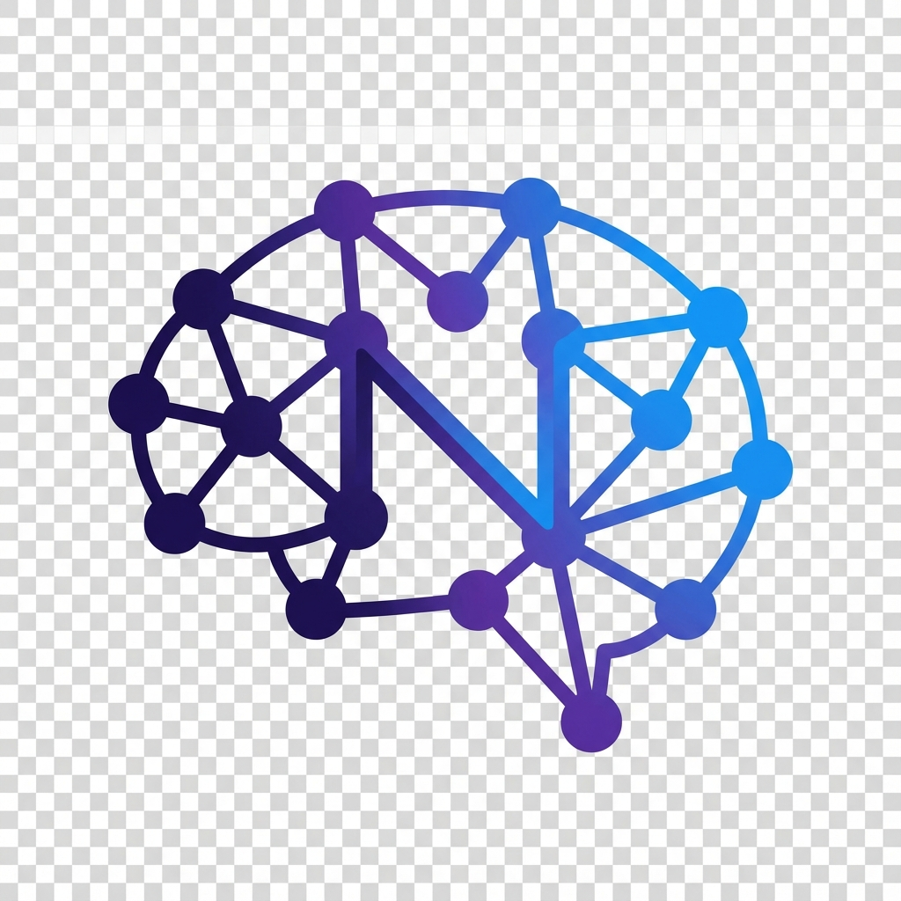
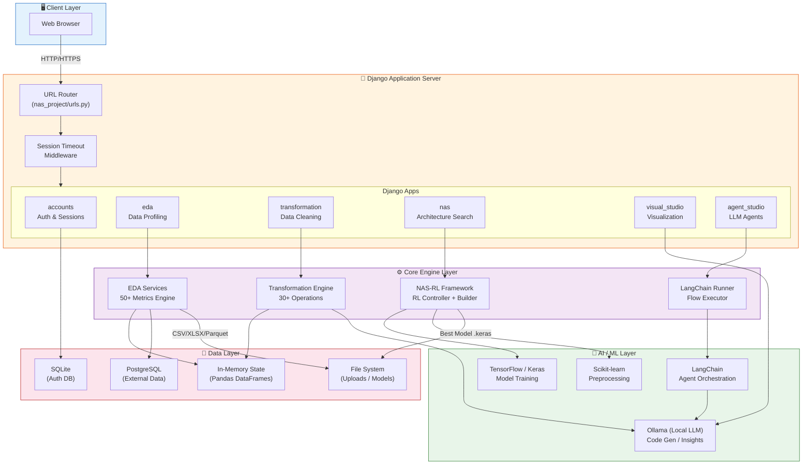
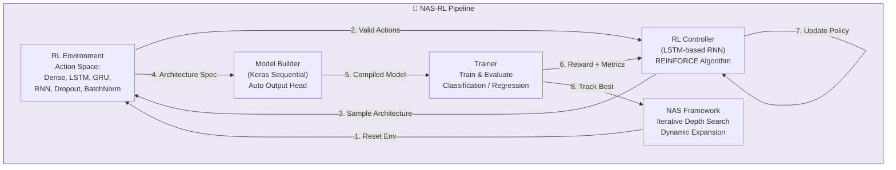

<![CDATA[<p align="center">
  
</p>

<h1 align="center">FlowMind</h1>

<p align="center">
  <strong>AI-Powered End-to-End Data Science & Engineering Platform</strong>
</p>

<p align="center">
  <a href="#features">Features</a> •
  <a href="#architecture">Architecture</a> •
  <a href="#tech-stack">Tech Stack</a> •
  <a href="#getting-started">Getting Started</a> •
  <a href="#modules">Modules</a> •
  <a href="#roadmap">Roadmap</a> •
  <a href="#contributing">Contributing</a>
</p>

<p align="center">
  
  
  
  
  
  
</p>

---

## Overview

**FlowMind** is a unified, AI-powered platform that streamlines the entire data science lifecycle — from raw data ingestion and exploratory analysis to automated neural architecture search and LLM agent orchestration — all within a single web interface. No more juggling between 10 different tools. One platform. One flow.

### Why FlowMind?

As data practitioners, we constantly juggle between multiple tools — one for EDA, another for transformation, a separate notebook for visualization, yet another for model building, and something else entirely for LLM workflows. FlowMind was born out of the frustration of this fragmented workflow.

**FlowMind lets you:**
- Connect to your data (PostgreSQL or CSV/XLSX/Parquet upload)
- Profile and explore it deeply with AI-generated insights
- Transform and clean it using both a pre-built catalog and natural language AI commands
- Visualize patterns with interactive drag-and-drop charting
- Automatically search for the best neural network architecture using Reinforcement Learning
- Orchestrate autonomous LLM agents with a visual node-based flow builder

All of this — **powered locally using Ollama** (no cloud API keys needed).

---

## Architecture

### High-Level System Architecture



### Neural Architecture Search (NAS) Pipeline



### Data Flow Architecture

```mermaid
flowchart LR
    subgraph Input["📥 Data Ingestion"]
        CSV["CSV / XLSX / Parquet<br/>File Upload"]
        LocalPath["Local File Path"]
        PG["PostgreSQL<br/>Database Connection"]
    end

    subgraph EDA_Module["🔍 EDA Module"]
        Stats["Statistical Profiling<br/>50+ Metrics per Column"]
        Quality["Data Quality Score<br/>Missing / Duplicates / Outliers"]
        Insights["AI-Generated Insights<br/>(Deterministic + LLM)"]
    end

    subgraph Transform_Module["🔧 Transformation Module"]
        Catalog["Pre-built Catalog<br/>30+ Operations"]
        ChatAI["AI Chat Assistant<br/>Natural Language → Code"]
        Batch["Batch Pipeline<br/>Sequential Execution"]
        Report["HTML Report Generator"]
    end

    subgraph Model_Module["🏗️ NAS Module"]
        DataPrep["Data Preparation<br/>Train/Val Split"]
        Search["RL-based Search<br/>Iterative Depth Expansion"]
        Export["Best Model Export<br/>(.keras)"]
    end

    subgraph Viz_Module["📊 Visual Studio"]
        DragDrop["Drag & Drop Builder<br/>Plotly.js Charts"]
        Summary["AI Chart Summaries<br/>(Local LLM)"]
    end

    subgraph Agent_Module["🤖 Agent Studio"]
        FlowBuilder["Node-based Flow Builder<br/>Drag & Connect"]
        ChatInterface["Chat Interface<br/>Run & Interact"]
    end

    CSV --> EDA_Module
    LocalPath --> EDA_Module
    PG --> EDA_Module

    EDA_Module --> Transform_Module
    Transform_Module --> Model_Module
    EDA_Module --> Viz_Module
    Transform_Module --> Viz_Module

    style Input fill:#e3f2fd,stroke:#1565c0
    style EDA_Module fill:#fff8e1,stroke:#f57f17
    style Transform_Module fill:#e8f5e9,stroke:#2e7d32
    style Model_Module fill:#fce4ec,stroke:#c62828
    style Viz_Module fill:#f3e5f5,stroke:#6a1b9a
    style Agent_Module fill:#e0f7fa,stroke:#00695c
```



---

## Features

### 1. Neural Architect (EDA + NAS Pipeline)

| Capability | Description |
|---|---|
| **Deep Data Profiling** | Automatic statistics for every column — missing values, distributions, skewness, kurtosis, outlier percentages, cardinality, correlations, and 50+ metrics |
| **AI-Generated Insights** | Deterministic data quality insights with optional LLM-powered analysis |
| **SQL Editor** | Built-in query editor for connected PostgreSQL databases with schema/table browsing |
| **Transformation Pipeline** | 30+ pre-built operations across 6 categories: imputation, deduplication, scaling, encoding, outlier handling, and distribution transforms |
| **AI Chat Transformations** | Natural language data transformations powered by Ollama (e.g., *"create a column by multiplying price and quantity"*) |
| **Neural Architecture Search** | Custom RL-based framework with iterative depth expansion, REINFORCE policy gradient, and automatic model building |
| **Report & Export** | Downloadable HTML transformation reports and best model export (`.keras`) |

### 2. Data Spectrum (Visual Intelligence Studio)

| Capability | Description |
|---|---|
| **Drag-and-Drop Charts** | Interactive visualization builder powered by Plotly.js |
| **Chart Types** | Bar, Line, Scatter, Histogram, Box, and Pie charts |
| **Axis Mapping** | Drag columns onto X, Y, Color, and Size axes |
| **AI Summaries** | LLM-generated insight summaries for every chart via local Ollama |

### 3. Agent Flow (Agent Studio)

| Capability | Description |
|---|---|
| **Visual Flow Builder** | Node-based drag-and-drop interface for LangChain workflows |
| **Components** | Chat Input, File Loader, Prompt Template, Local LLM, Chat Output |
| **Node Connections** | Bezier curve connections with configurable model parameters (temperature, max tokens, system prompt) |
| **Chat Interface** | Dedicated chat interface to run and interact with built flows |
| **Local LLM** | Fully powered by local Ollama models — no external API dependency |

### 4. Industry Core (Coming Soon)

Pre-trained models specialized for specific industry sectors.

---

## Tech Stack

| Layer | Technologies |
|---|---|
| **Backend** | Python 3.12, Django 5.2, SQLAlchemy |
| **Frontend** | Django Templates, TailwindCSS, Plotly.js |
| **Machine Learning** | TensorFlow 2.20, Keras 3, Scikit-learn 1.7 |
| **AI / LLM** | LangChain 1.2, Ollama (local), CodeLlama, Qwen 2.5 |
| **Data Processing** | Pandas 2.3, NumPy 2.3, SciPy 1.16 |
| **Database** | SQLite (auth), PostgreSQL (external data via psycopg2) |
| **Visualization** | Plotly.js, Matplotlib |
| **Vector Store** | Qdrant Client (available) |
| **File Formats** | CSV, XLSX, Parquet (via fastparquet/pyarrow) |

---

## Project Structure

```
nas_project/
├── accounts/                  # Authentication & session management
│   ├── middleware.py           # Configurable session timeout middleware
│   ├── views.py               # Login, register, forgot password, homepage
│   ├── urls.py                # Auth routes
│   └── templates/accounts/    # Login, register, homepage templates
│
├── eda/                       # Exploratory Data Analysis module
│   ├── services.py            # EDA engine (50+ metrics, comprehensive stats)
│   ├── db_utils.py            # PostgreSQL connection & query execution
│   ├── views.py               # Upload, stats, preview, DB connect APIs
│   ├── urls.py                # EDA routes & API endpoints
│   └── templates/eda/         # EDA dashboard templates
│
├── transformation/            # Data transformation module
│   ├── services.py            # Transformation state & logic engine
│   ├── transformation_helpers.py  # 30+ transformation implementations + Ollama AI
│   ├── transformation_catalog.py  # Pre-built transformation card definitions
│   ├── report_generator.py    # HTML report generation
│   ├── views.py               # Transformation APIs (apply, batch, chat, report)
│   ├── urls.py                # Transformation routes
│   └── templates/transformation/  # Transformation UI templates
│
├── nas/                       # Neural Architecture Search module
│   ├── services.py            # NAS orchestration, data prep, threaded search
│   ├── views.py               # NAS APIs (prepare, start, stop, status, download)
│   ├── urls.py                # NAS routes
│   └── templates/nas/         # NAS dashboard templates
│
├── nas_rl/                    # Custom RL-based NAS framework (core engine)
│   ├── core.py                # NASFramework — main search loop with iterative depth
│   ├── controller.py          # RLAgent — LSTM controller with REINFORCE
│   ├── builder.py             # ModelBuilder — Keras Sequential model construction
│   ├── environment.py         # RLEnvironment — action space, constraints, vocabulary
│   └── trainer.py             # Trainer — model training & evaluation metrics
│
├── visual_studio/             # Data visualization module
│   ├── views.py               # Columns, viz types, plot data, AI summary APIs
│   ├── urls.py                # Visual Studio routes
│   └── templates/visual_studio/  # Drag-and-drop visualization templates
│
├── agent_studio/              # LLM Agent orchestration module
│   ├── langchain_runner.py    # LangChain flow parser & executor
│   ├── utils.py               # Ollama model discovery
│   ├── urls.py                # Agent Studio routes
│   └── templates/agent_studio/  # Node-based flow builder templates
│
├── utils/                     # Shared utilities
│   ├── common.py              # Upload folder helpers
│   └── session_config.py      # YAML-based session timeout configuration
│
├── nas_project/               # Django project configuration
│   ├── settings.py            # App settings, installed apps, middleware
│   ├── urls.py                # Root URL configuration
│   └── wsgi.py                # WSGI entry point
│
├── static/images/             # Static assets (logos, backgrounds)
├── session_config.yaml        # Configurable session timeout (1–24 hours)
├── requirements.txt           # Python dependencies (170+ packages)
├── manage.py                  # Django management script
└── README.md                  # This file
```

---

## Getting Started

### Prerequisites

- **Python 3.12+**
- **Ollama** installed and running locally ([Install Ollama](https://ollama.com/download))
- **PostgreSQL** (optional — only needed for database connectivity features)

### Installation

1. **Clone the repository**
   ```bash
   git clone https://github.com/priyamghosh0412/NeuralFlow-Studio.git
   cd NeuralFlow-Studio/nas_project
   ```

2. **Create and activate a virtual environment**
   ```bash
   python -m venv venv
   source venv/bin/activate        # macOS/Linux
   # venv\Scripts\activate         # Windows
   ```

3. **Install dependencies**
   ```bash
   pip install -r requirements.txt
   ```

4. **Pull required Ollama models**
   ```bash
   ollama pull codellama:7b        # For AI code generation in transformations
   ollama pull qwen2.5:3b          # For chart summaries in Visual Studio
   ollama pull llama3              # For Agent Studio flows
   ```

5. **Run database migrations**
   ```bash
   python manage.py migrate
   ```

6. **Create a superuser**
   ```bash
   python manage.py createsuperuser
   ```

7. **Start the development server**
   ```bash
   python manage.py runserver
   ```

8. **Open your browser** and navigate to `http://127.0.0.1:8000/`

### Configuration

#### Session Timeout

Edit `session_config.yaml` to configure session duration (1–24 hours):

```yaml
# Session timeout configuration
duration_hours: 2
```

---

## Modules in Detail

### EDA Module (`/eda/`)

The EDA module provides comprehensive data profiling with 50+ statistical metrics per column:

- **Numerical**: min, max, mean, median, std, variance, skewness, kurtosis, IQR, percentiles (p1–p99), outlier count/percentage, zeros count, negative count, coefficient of variation
- **Categorical**: unique categories, top-5 frequencies, rare category count, dominant category detection, imbalance ratio
- **Datetime**: date range, frequency detection (daily/weekly/monthly), average gap, peak/low activity dates
- **Dataset-level**: correlation matrix, high-correlation pair detection (>0.8), missing data analysis, data quality score, constant column detection, ID-like column alerts

**Data Sources Supported:**
- File Upload (CSV, XLSX, Parquet)
- Local File Path
- PostgreSQL Database (with schema/table browser and SQL editor)

### Transformation Module (`/transformation/`)

30+ pre-built transformations organized into 6 categories:

| Category | Operations |
|---|---|
| **Missing Values** | Mean, Median, Mode, Forward Fill, Backward Fill, Drop Rows |
| **Duplicates** | Remove All Duplicates, Remove by Subset Columns |
| **Outlier Handling** | IQR Removal, Z-Score Removal, Percentile Clipping, Log Transform, Winsorization |
| **Scaling** | Standard (Z-Score), Min-Max, Robust, MaxAbs, Unit Vector |
| **Distribution** | Log, Square Root, Box-Cox, Yeo-Johnson, Quantile, Reciprocal |
| **Encoding** | Label Encoding, One-Hot Encoding, Ordinal Encoding |

**AI Chat Transformations:** Describe what you want in natural language, and the AI generates executable Python code using local Ollama models. Includes error resolution with AI-powered debugging suggestions.

### NAS Module (`/nas/`)

Custom Reinforcement Learning-based Neural Architecture Search:

- **Search Strategy**: Iterative Depth Search with Dynamic Expansion (starts at depth 2, expands when performance plateaus)
- **RL Controller**: LSTM-based RNN using REINFORCE policy gradient algorithm
- **Action Space**: Dense, LSTM, GRU, SimpleRNN, Dropout, BatchNormalization layers with configurable units (16–256) and activations (ReLU, Tanh, Sigmoid, Linear)
- **Model Builder**: Automatic Keras Sequential model construction with smart rank handling (2D↔3D for RNN layers) and auto output head (classification/regression)
- **Metrics**: Accuracy, Precision, Recall (classification) | R², RMSE, MAPE, 1-MAPE (regression)
- **Export**: Best model saved as `.keras` file, search history as CSV report

### Visual Studio (`/visual-studio/`)

Interactive drag-and-drop visualization builder:

- 6 chart types: Bar, Line, Scatter, Histogram, Box, Pie
- Drag columns onto X, Y, Color, and Size axes
- Powered by Plotly.js for interactive, zoomable charts
- AI-generated insight summaries for each visualization via local Ollama

### Agent Studio (`/agent-studio/`)

Visual node-based LLM workflow builder:

- Drag-and-drop components: Chat Input, Prompt Template, Local LLM, Chat Output
- LangChain integration with LCEL (LangChain Expression Language) chains
- Configurable model parameters (model selection, temperature)
- Auto-discovers locally available Ollama models
- Dedicated chat interface for flow execution and interaction

---

## API Reference

### EDA Endpoints

| Method | Endpoint | Description |
|---|---|---|
| `POST` | `/eda/api/upload_data` | Upload CSV/XLSX/Parquet file |
| `POST` | `/eda/api/load_from_path` | Load data from local file path |
| `GET` | `/eda/api/data_stats` | Get comprehensive EDA statistics |
| `GET` | `/eda/api/data_preview` | Get paginated data preview |
| `POST` | `/eda/api/db/connect` | Test PostgreSQL connection |
| `POST` | `/eda/api/db/tables` | Get tables for a schema |
| `POST` | `/eda/api/db/query` | Execute SQL query (preview) |
| `POST` | `/eda/api/db/load` | Load query results into EDA |
| `GET` | `/eda/api/insights` | Generate AI insights |

### Transformation Endpoints

| Method | Endpoint | Description |
|---|---|---|
| `GET` | `/transformation/api/get_transformation_options` | Get available transformations |
| `POST` | `/transformation/api/apply_transformations` | Apply single transformation |
| `POST` | `/transformation/api/apply_selected_batch` | Apply batch transformations |
| `GET` | `/transformation/api/get_current_preview` | Get current data preview |
| `POST` | `/transformation/api/chat_transform` | AI chat transformation |
| `GET` | `/transformation/api/download_report` | Download HTML report |

### NAS Endpoints

| Method | Endpoint | Description |
|---|---|---|
| `GET` | `/nas/api/columns` | Get available columns |
| `POST` | `/nas/api/prepare_data` | Prepare train/val split |
| `POST` | `/nas/api/start` | Start NAS search |
| `POST` | `/nas/api/stop` | Stop NAS search |
| `GET` | `/nas/api/status` | Get search status |
| `GET` | `/nas/download_report` | Download search report (CSV) |
| `GET` | `/nas/download_model` | Download best model (.keras) |

### Visual Studio Endpoints

| Method | Endpoint | Description |
|---|---|---|
| `GET` | `/visual-studio/api/columns` | Get columns with types |
| `GET` | `/visual-studio/api/viz_types` | Get available chart types |
| `POST` | `/visual-studio/api/get_plot_data` | Get data for plotting |
| `POST` | `/visual-studio/api/generate_summary` | Generate AI chart summary |

### Agent Studio Endpoints

| Method | Endpoint | Description |
|---|---|---|
| `GET` | `/agent-studio/api/models/` | Get available Ollama models |
| `POST` | `/agent-studio/api/run/` | Execute a LangChain flow |

---

## Current Limitations

> **FlowMind is currently in active development.**

- **No Persistent Sessions**: All data (uploaded datasets, transformation states, EDA results, NAS search history) is held in server memory only. Shutting down the server loses all progress.
- **No Project Save/Load**: You cannot return to a previously worked-on project.
- **Single User**: The in-memory state model is designed for single-user usage per server instance.
- **CPU Only**: TensorFlow is forced to CPU mode to avoid macOS MPS hangs.

---

## Roadmap

- [ ] Persistent user sessions and project management
- [ ] State recovery and save/load functionality
- [ ] Multi-user support with isolated workspaces
- [ ] Industry Core — pre-trained models for specific sectors
- [ ] Advanced NAS strategies (evolutionary, Bayesian)
- [ ] GPU acceleration support
- [ ] Docker containerization
- [ ] Export to Jupyter Notebook
- [ ] Collaborative features

---

## Contributing

Contributions are welcome! Whether it's frontend, backend, AI/ML, or DevOps — please feel free to open issues or submit pull requests.

1. Fork the repository
2. Create your feature branch (`git checkout -b feature/amazing-feature`)
3. Commit your changes (`git commit -m 'Add amazing feature'`)
4. Push to the branch (`git push origin feature/amazing-feature`)
5. Open a Pull Request

---

## License

This project is open source. See the repository for license details.

---

<p align="center">
  <strong>GitHub:</strong> <a href="https://github.com/priyamghosh0412/NeuralFlow-Studio">github.com/priyamghosh0412/NeuralFlow-Studio</a>
</p>

<p align="center">
  Built with ❤️ by <a href="https://github.com/priyamghosh0412">Priyam Ghosh</a>
</p>
]]>
